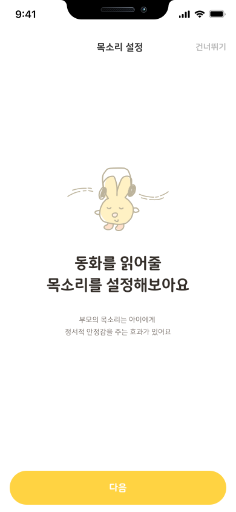
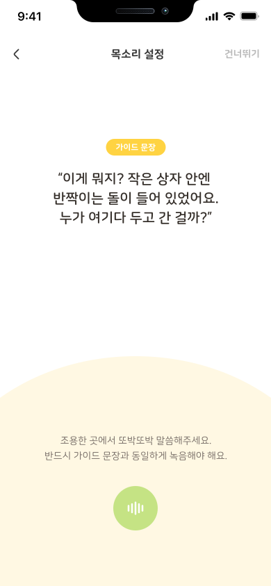
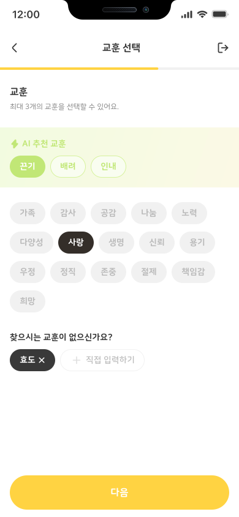
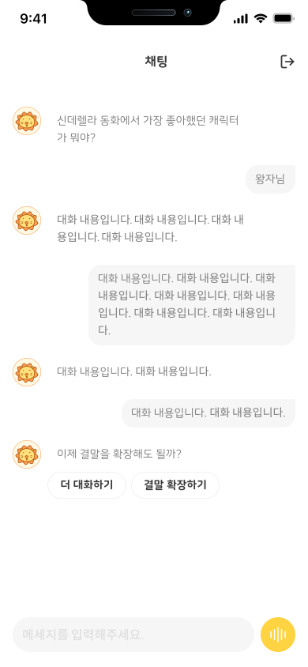
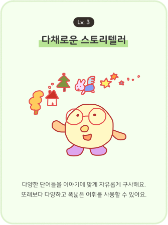
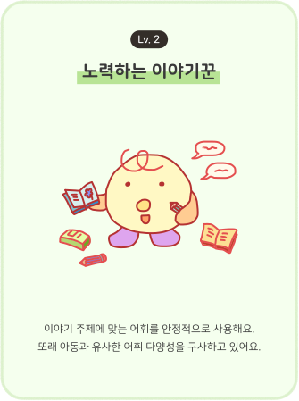

  

# 🧸 Stony – 부모의 목소리로 완성되는 AI 동화

Stony는 부모님의 **목소리와 경험**을 바탕으로  
아이에게 따뜻하고 교육적인 동화를 만들어주는 서비스입니다.

AI 보이스 클로닝, 부모 경험 기반 동화 생성,  
명작 동화 결말 확장, 아이 발화 분석까지  
아이의 정서·언어 발달을 돕는 기능들이 포함되어 있어요.

 

---

## 🌐 배포 링크  
👉 https://frontend-puof.vercel.app/

 

---

# ✨ 주요 기능

## 🎤 1. 부모 보이스 클로닝  
부모 목소리를 AI가 자연스럽게 복제해  
아이에게 “엄마/아빠 목소리로 읽어주는 동화”를 제공합니다.

- 짧은 녹음만으로 클론 생성  
- 자연스러운 억양 유지  
- 생성된 동화 전체를 부모 목소리로 재생 가능

  
  &nbsp;&nbsp;&nbsp;
  

---

## 📖 2. 부모 경험 기반 AI 동화 생성  
부모님의 어릴 적 이야기, 가치관, 전하고 싶은 메시지를  
AI가 *스토리 구조에 맞게 동화로 재구성*합니다.

- 음성(STT) 또는 텍스트 기반 에피소드 입력  
- 핵심 사건/감정/교훈 자동 추출  
- 아이 연령에 맞는 문장 난이도 조절  
- 필요 시 여러 번 재생성 가능

  
  &nbsp;&nbsp;&nbsp;
  

---

## 📘 3. 명작 동화 결말 확장  
아이가 챗봇과 대화하며 **기존 명작 동화의 새로운 결말**을 만들어볼 수 있어요.

- 대체 결말 / 추가 사건 / 캐릭터 행동 변화  
- 아이 선택에 따라 스토리 분기  
- Dramatica Pro 기반 구조 적용해 완성도 향상

  
  &nbsp;&nbsp;&nbsp;
  

---

## 🧠 4. 아이 발화 분석 리포트  
아이가 챗봇과 나눈 대화를 기반으로  
어휘력·표현력·성향을 간단히 분석한 리포트를 제공합니다.

- NDW(고유 단어 수) 분석  
- 월별 발달 추적  
- NEO 성향 분석 적용

  
  &nbsp;&nbsp;&nbsp;
  
  &nbsp;&nbsp;&nbsp;
  

 

---

# 🛠 기술 스택

## 🎨 Frontend  
- React

## 🐍 Backend  
- Django DRF  
- Gunicorn

## 🤖 AI Engines  
- GPT-4o-mini / GPT-5.1 – 스토리 생성  
- GPT-Image-1mini – 삽화 생성  
- Whisper / NeMoTTS / OpenVoice – 보이스 클로닝·STT

## ☁ Infra & DB  
- AWS S3  
- MySQL (RDS)  
- Redis  
- Nginx  
- Docker Compose  

 

---

# 🦁 Stony를 만든 사람들

| 이름 | 역할 | 구현 파트 |
|------|--------|---------|
| 이은서 | 기획 · 디자인 | 서비스 기획, 디자인 |
| 송나영 | 기획 · 디자인 | 서비스 기획, 디자인 |
| 이예영 | 프론트엔드 | 온보딩, AI 스토리 생성, 결말확장 |
| 서예린 | 프론트엔드 | 홈, AI 삽화 생성, 스토리 재생 |
| 김연우 | 백엔드 | AI | 음성 클로닝 & TTS, 아이 분석 리포트, AWS EC2, Redis, RDS |
| 신지민 | 백엔드 | AI | 동화 생성, STT 음성 입력, 확장 동화 생성 및 채팅, AWS S3 |
